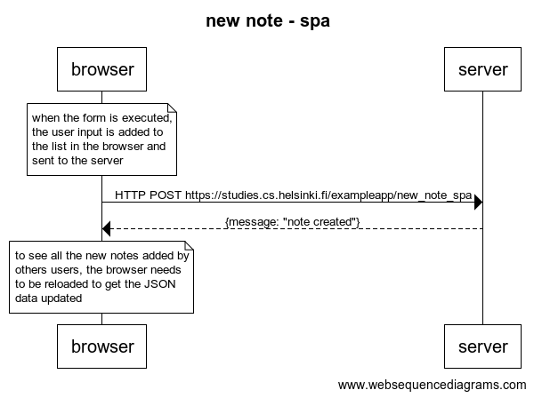

## 0.6: new note - spa


```
title new note - spa

note over browser:
when the form is executed,
the user input is added to 
the list in the browser and 
sent to the server
end note
browser->server: HTTP POST https://studies.cs.helsinki.fi/exampleapp/new_note_spa
server-->browser: {message: "note created"}

note over browser:
to see all the new notes added by 
others users, the browser needs 
to be reloaded to get the JSON
data updated
end note
```
